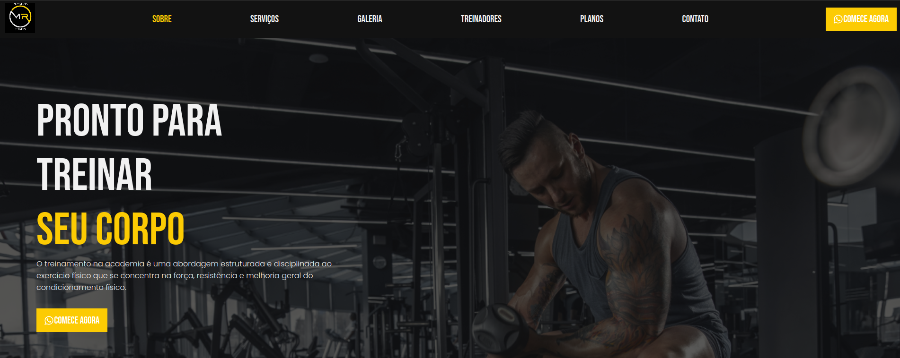

[TYPESCRIPT__BADGE]: https://img.shields.io/badge/typescript-D4FAFF?style=for-the-badge&logo=typescript
[REACT__BADGE]: https://img.shields.io/badge/React-005CFE?style=for-the-badge&logo=react

<h1 align="center" style="font-weight: bold;">Portifolio 💻</h1>

<div align="center">

![react][REACT__BADGE]
![typescript][TYPESCRIPT__BADGE]


</div>

<p align="center">
 <a href="#about">About</a> • 
 <a href="#started">Getting Started</a> • 
  <a href="#started">App Routes</a> • 
  <a href="#colab">Collaborators</a> •
 <a href="#contribute">Contribute</a>
</p>

<p align="center">
    
</p>

<h2 id="about">📌 About</h2>

Este projeto é uma aplicação web desenvolvida para uma academia local, utilizando React, Styled-Components e TypeScript. A aplicação oferece uma interface intuitiva para os usuários se inscreverem em aulas. Com Styled-Components, o design da interface é dinâmico e responsivo, enquanto o uso de TypeScript garante maior segurança e previsibilidade no desenvolvimento, resultando em uma aplicação robusta e de fácil manutenção.

<h2 id="started">🚀 Getting started</h2>

Para executar o projeoto em localhost veja os passos abaixo

<h3>Prerequisites</h3>

Pre-requesitos necessarios em sua maquina para executar o projeto:

- [NodeJS](https://nodejs.org/en)
- [Git](https://git-scm.com/downloads)
- [vscode](https://code.visualstudio.com/)

<h3>Cloning</h3>

Como clonar o projeto;

```bash
git clone https://github.com/Carlosxc-dev/MR_fitness.git
```

<h3>Starting</h3>

Como iniciar o projeto:

```bash
cd MR_fitness
npm install .
npm run dev
```

Apos os passos acima abra o navegador em http://localhost:5173/

<h2 id="routes">📍 Application Routes</h2>

| route        | description             |
| ------------ | ----------------------- |
| <kbd>/</kbd> | single page application |

<h2 id="colab">🤝 Collaborators</h2>

<table>
  <tr>
    <td align="center">
      <a href="#">
        <br>
        <sub>
          <b>Carlos Henrique</b>
        </sub>
      </a>
    </td>
  </tr>
</table>

<h2 id="contribute">📫 Contribute</h2>

1. `git clone https://github.com/Carlosxc-dev/MR_fitness.git`
2. `git checkout -b feature/NAME`
3. Siga os padrões de commit
4. Abra um Pull Request explicando o problema resolvido ou o recurso criado, se houver, anexe uma captura de tela das modificações visuais e aguarde a revisão!

<h3>Documentations that might help</h3>

[📝 How to create a Pull Request](https://www.atlassian.com/br/git/tutorials/making-a-pull-request)

[💾 Commit pattern](https://gist.github.com/joshbuchea/6f47e86d2510bce28f8e7f42ae84c716)
